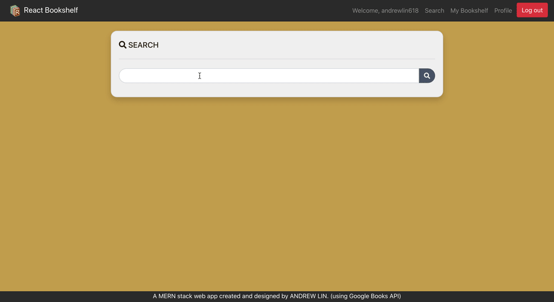
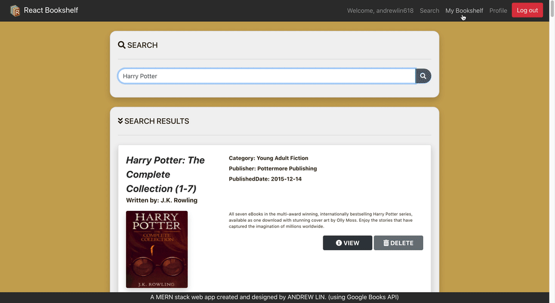

# React-Bookshelf
Online platform for reading-lovers to search books and store them into their personal online bookshelf.

</img>
<br /><br />

## Table of Contents
* [About The Project](#about-the-project)
  * [Usage](#usage)
  * [Stretch Goals](#stretch-goals)
  * [Build With](#build-with)
* [Getting Started](#getting-started)
  * [Installation](#installation)
* [Contact](#contact)
<br /><br />

## About The Project

React bookshelf is a full-stack web application that allows you to search book from google books API and store in your personal bookshelf.
After you entered the keywords and submitted, it will return books from google books API, filtering only books with title, authors, categories, publisher, publishedDate, image, and description.

[Try it now!](https://reactbookshelf.herokuapp.com/)

### Usage
1. Login with email or google account:<br />
</img>
<br />

2. Search a book and add to bookshelf:<br />
</img>
<br />

3. Remove books from your bookshelf:
</img>
<br />

### Stretch Goals
* Use Plaid API for bank account linking.
* Use Uber driver and other API to submit new shift automatically.
* Use different calculation for rush hour & non rush hour.

### Build With
* React.js
* Node.js
* Express.js
* Mongo DB Atlas
* Google Books API
* Font awesome 
* Bootstrap
* Heroku 

## Getting Started

### Installation

1. Clone the repo to local:
```
git clone https://github.com/andrewlin618/React-Bookshelf.git
cd React-Bookshelf
```

2. Install the dependencies for Server:
* "axios": "^0.19.2",
* "concurrently": "^5.1.0",
* "dotenv": "^8.2.0",
* "express": "^4.17.1",
* "minimist": "^1.2.5",
* "mongoose": "^5.8.11",
* "nodemon": "^2.0.2"
```
npm install
```

3. Install the dependencies for Client:
* "axios": "^0.19.2",
* "react-dom": "^16.12.0",
* "react-router-dom": "^5.1.2"

```
cd client && npm install
```

4. Run the app with:
```
npm start
```
Open http://localhost:3001 to take a look around

## Contact
- LinkedIn: [Andrew Lin](https://www.linkedin.com/in/andrewlin618)
- Email:    &nbsp; &nbsp; `andrewlin618@gmail.com`


